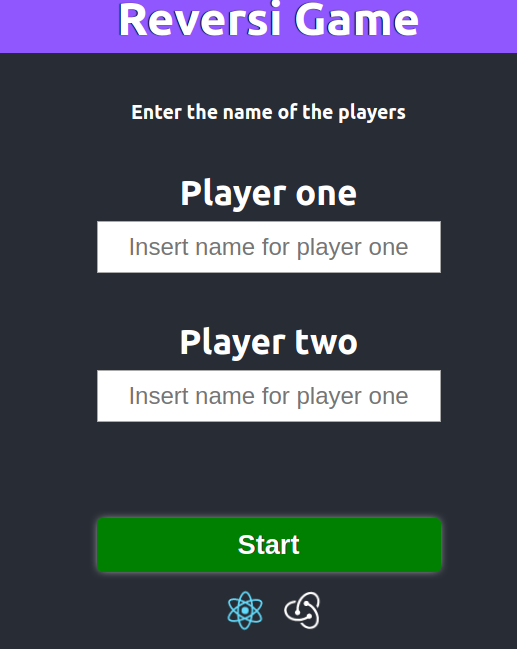
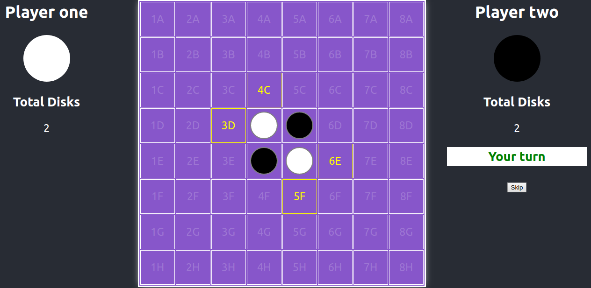

# Reversi Game

### React Development test

[Demo in Now](https://reversi-game.sebastiancardoso92.now.sh)

This project was bootstrapped with [Create React App](https://github.com/facebook/create-react-app).

## Libraries
1. [Redux Undo](https://github.com/omnidan/redux-undo), a library that provides simple Undo and Redo functionality for any part of your Redux tree.

## Available Scripts

Install dependencies

### `npm i`

In the project directory, you can run:

### `npm start`

Runs the app in the development mode. 
Open [http://localhost:3000](http://localhost:3000) to view it in the browser..

### `npm test`

Jest and Enzyme test

### `npm run build`

Builds the app for production to the `build` folder. 

 ## Styles
 Pure CSS

## Directories
1. Screens ---> Pages:
   1. Start
   2. Gaming
   3. End
2. Containers ---> StateFull components
3. Components ---> Stateless Components
4. Assets ---> CSS and SVG files
5. Test ---> Snapshoot testing
6. Actions, reducers, initialStates, types ---> Redux
   
